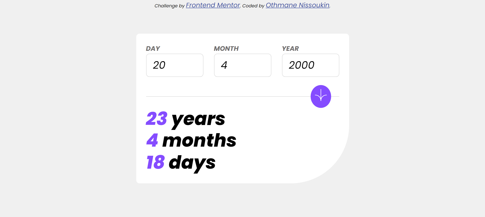

# Frontend Mentor - Age calculator app solution

This is a solution to the [Age calculator app challenge on Frontend Mentor](https://www.frontendmentor.io/challenges/age-calculator-app-dF9DFFpj-Q). Frontend Mentor challenges help you improve your coding skills by building realistic projects.

### Screenshot

### Links

-   Solution URL: [Source Code](https://github.com/OthmaneNissoukin/fem-react-age-calculator)
-   Live Site URL: [View Demo](https://othmanenissoukin.github.io/fem-react-age-calculator/)

### Built with

-   Semantic HTML5 markup
-   CSS custom properties
-   Flexbox
-   ReactJS
-   Mobile-first approach
-   [React](https://reactjs.org/) - JS library

## Author

-   Frontend Mentor - [@OthmaneNissoukin](https://www.frontendmentor.io/profile/OthmaneNissoukin)

---

## Run The App Locally

This project was bootstrapped with [Create React App](https://github.com/facebook/create-react-app).

## Available Scripts

In the project directory, you can run:

### `npm start`

Runs the app in the development mode.\
Open [http://localhost:3000](http://localhost:3000) to view it in your browser.
